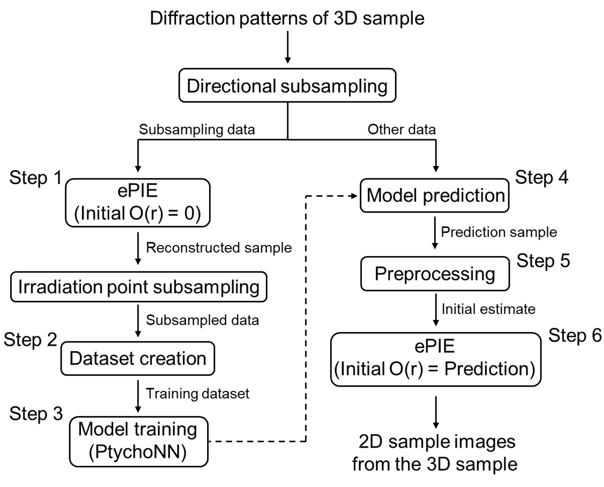

# Ptychography-Workflow

This repository contains the implementation of the workflow proposed in our paper "Developing an End-to-End 3D X-ray Ptychography Workflow Using Surrogate Models", currently under review at CCPE.

The proposed workflow implements a method for creating a sample-specific surrogate model on-the-fly from a subset of observed data in 3D X-ray ptychography, and for using the model’s predictions to perform iterative phase retrieval.

Compared to reconstruction using ePIE alone, our workflow achieves up to a 2.72× speed-up.

## Detailed workflow of the proposed method

## References
[1] Mathew J Cherukara, Tao Zhou, Youssef Nashed, Pablo Enfedaque, Alex Hexemer, Ross J Harder, and Martin V Holt. AI-enabled high-resolution scanning coherent diffraction imaging. Applied Physics Letters, 117(4), 2020.

[2] Yudong Yao, Henry Chan, Subramanian Sankaranarayanan, Prasanna Balaprakash, Ross J Harder, and Mathew J Cherukara. AutoPhaseNN: unsupervised physics-aware deep learning of 3D nanoscale Bragg coher ent diffraction imaging. npj Computational Materials, 8(1):124, 2022.

[3] Andrew M Maiden and John M Rodenburg. An improved ptychographical phase retrieval algorithm for diffractive imaging. Ultramicroscopy, 109(10):1256–1262, 2009.
